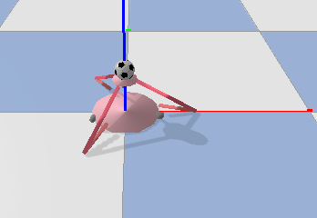

# Gym Delta Robot Trampoline

Authors: Rico Ruotong Jia(ruotongjia2020@u.northwestern.edu), Yipeng Pan 

The trampoline bounces a ball using a delta arm trained by DDPG! We also have included a PyBullet + OpenAI Gym environment of a Delta_Arm.  

### Minimum System Requirement
- Python 3.6

### Links 
 - Github [https://github.com/RicoJia/gym-delta-robot-trampoline](https://github.com/RicoJia/gym-delta-robot-trampoline)
 - **NOT READY** Pypi [https://pypi.org/project/gym-delta-robot-trampoline/](https://pypi.org/project/gym-delta-robot-trampoline/)

### Install
**NOT READY** Install with `pip`:

    pip install gym-delta-robot-trampoline
    
**READY** Or, install from source:

    git clone https://github.com/RicoJia/gym-delta-robot-trampoline
    cd gym-delta-robot-trampoline
    pip install .

### Usage
See the environment, in the root of the package:
 
     python3 main.py
You can interact with the environment by clicking and dragging, but note that our simulation is running much 
faster than real time, so you might not see the ball falling to the ground before the episode ends, or 
you might see a higher reward than expected due to small vibrations in our mouse dragging motion.   

